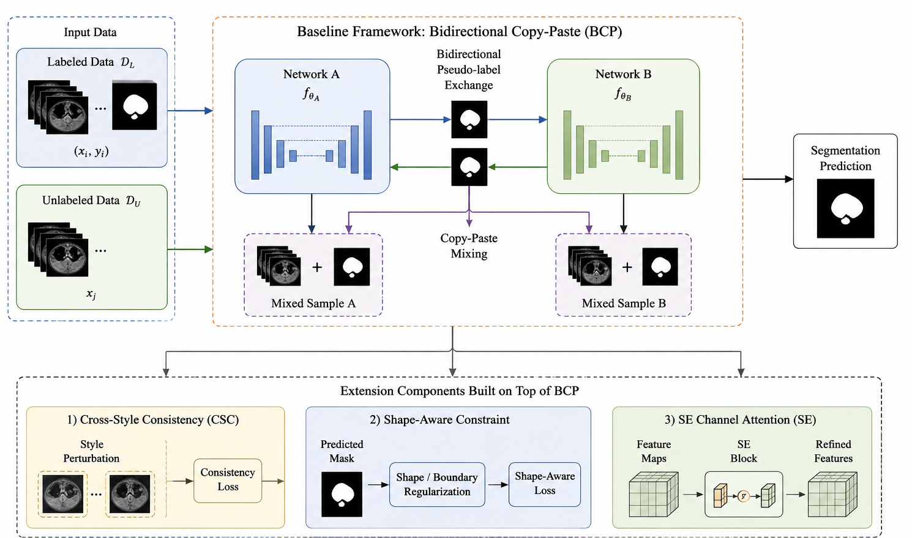
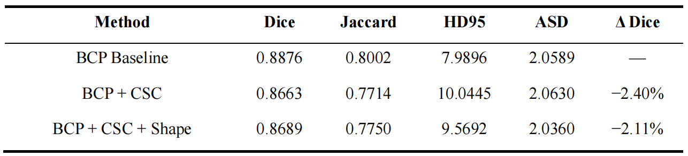
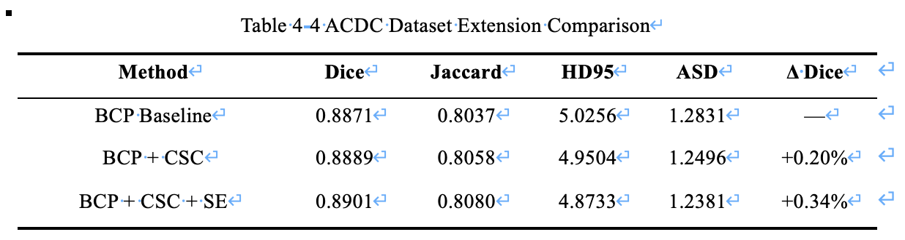

# Semi-Supervised Medical Image Segmentation

## Overview

This repository contains implementation files and experimental configurations developed as part of my Master's thesis in Software Engineering at the University of Electronic Science and Technology of China (UESTC).

The project investigates the extension of the Bidirectional Copy-Paste (BCP) semi-supervised medical image segmentation framework through Cross-Style Consistency (CSC), Shape-Aware Constraints, and SE Channel Attention.

Experiments were conducted on the Left Atrium (LA) and Automated Cardiac Diagnosis Challenge (ACDC) datasets under limited-label semi-supervised learning settings.

## Framework Overview

## Methodology

The research follows a progressive experimental design:

1. Train and evaluate the baseline BCP framework.
2. Integrate Cross-Style Consistency (CSC) to promote robustness against appearance variations.
3. Introduce Shape-Aware Constraints to encourage structural consistency.
4. Integrate SE Channel Attention to improve feature representation learning.
5. Evaluate all configurations using Dice, Jaccard, HD95, and ASD.

## Experimental Configurations

### Left Atrium (LA) Dataset

- BCP Baseline
- BCP + CSC
- BCP + CSC + Shape-Aware Constraint

### ACDC Dataset

- BCP Baseline
- BCP + CSC
- BCP + CSC + SE Channel Attention

## Results

### Left Atrium (LA) Dataset

### ACDC Dataset

## Code Contents

The repository includes selected implementation files used for the thesis experiments:

- Experiment-specific training scripts for LA and ACDC configurations
- Evaluation scripts for LA and ACDC testing
- Shared framework utilities and network factory files

Large checkpoints, datasets, training logs, and raw prediction folders are intentionally excluded.

## Datasets

This work uses the publicly available LA and ACDC datasets.

Please obtain the datasets from their official sources and follow the corresponding licensing and access requirements.

## Technical Environment

- Python 3.8.20
- PyTorch 1.8.1
- CUDA 10.2
- Ubuntu 20.04.3 LTS
- NVIDIA Tesla M60 GPU (8 GB)
- VNet (LA Experiments)
- UNet (ACDC Experiments)

## Citation

If you use this work in academic research, please cite the corresponding Master's thesis.

## Author

Carlos S. B. Manuel

Master of Software Engineering  
University of Electronic Science and Technology of China (UESTC)
